# burger

  

[Deployed App](https://enthousiaste-choucroute-00740.herokuapp.com/)

  ## Description
  This is an app that runs in the browser and uses MySQL to store burger data. Following the MVC design pattern, it uses a simple ORM written from scratch and uses Handlebars to generate the HTML. It is responsive to most screen sizes but is especially optimized for sizes common to restaurant POS tablet widths.

  ## Table of Contents
  * [Usage](#usage)
  * [FutureDevelopment](#futuredevelopment)
  * [License](#license)
  * [Contributing](#contributing)
  * [Tests](#tests)
  * [Questions](#questions)

  ## Usage
  * Burger App UI seen here at 768px and 1025px widths with three un-devoured burgers.

    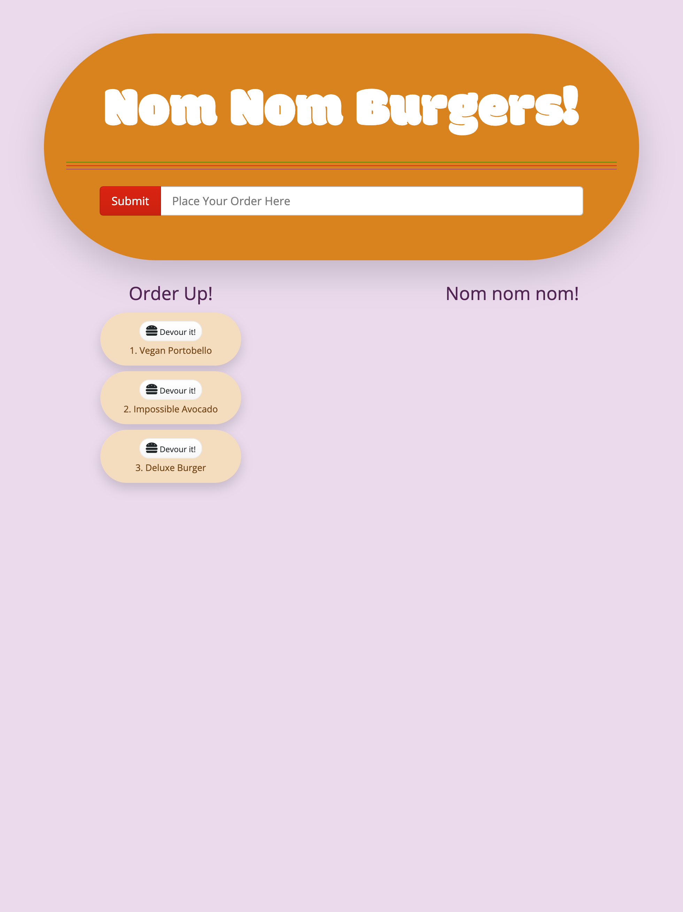   

  * Burger orders can be submitted in the burger window by entering a burger name.

    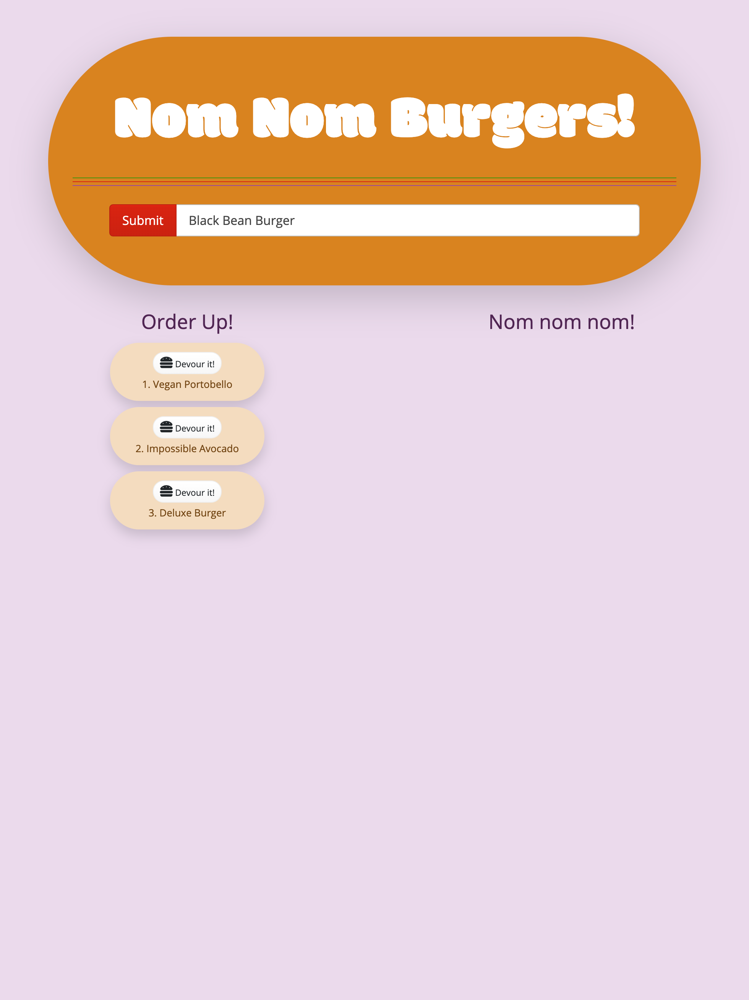   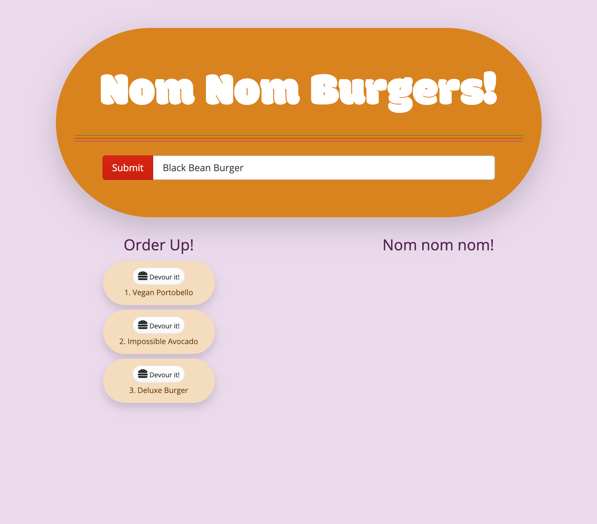

  * They are then immediately prepared and placed in the Order Up! window, ready to be served.

    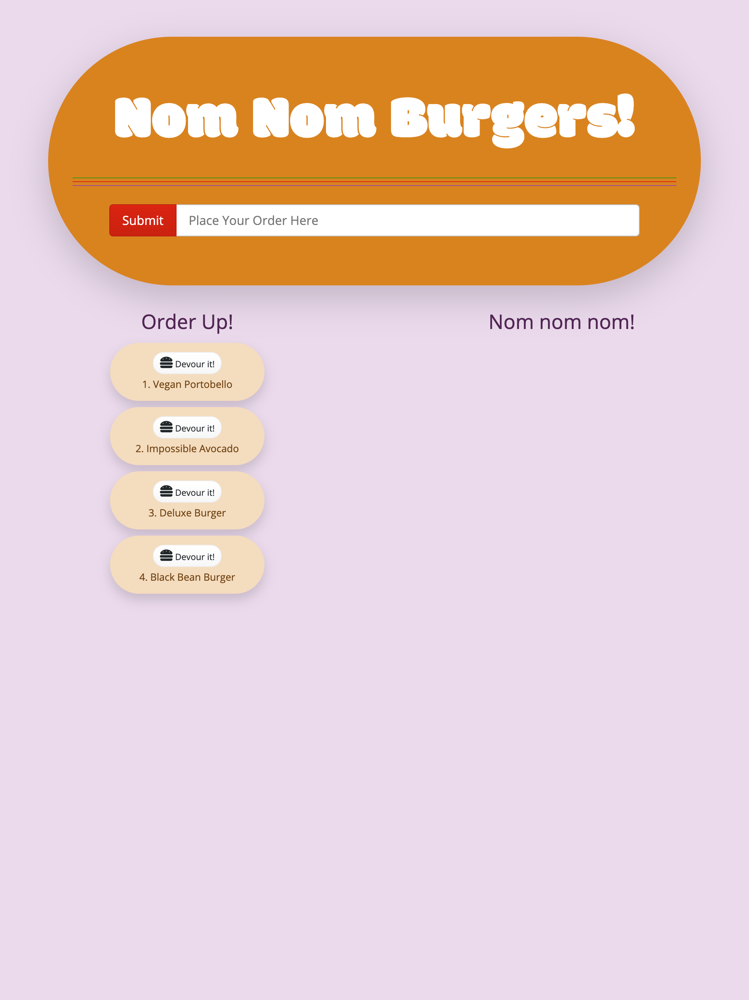   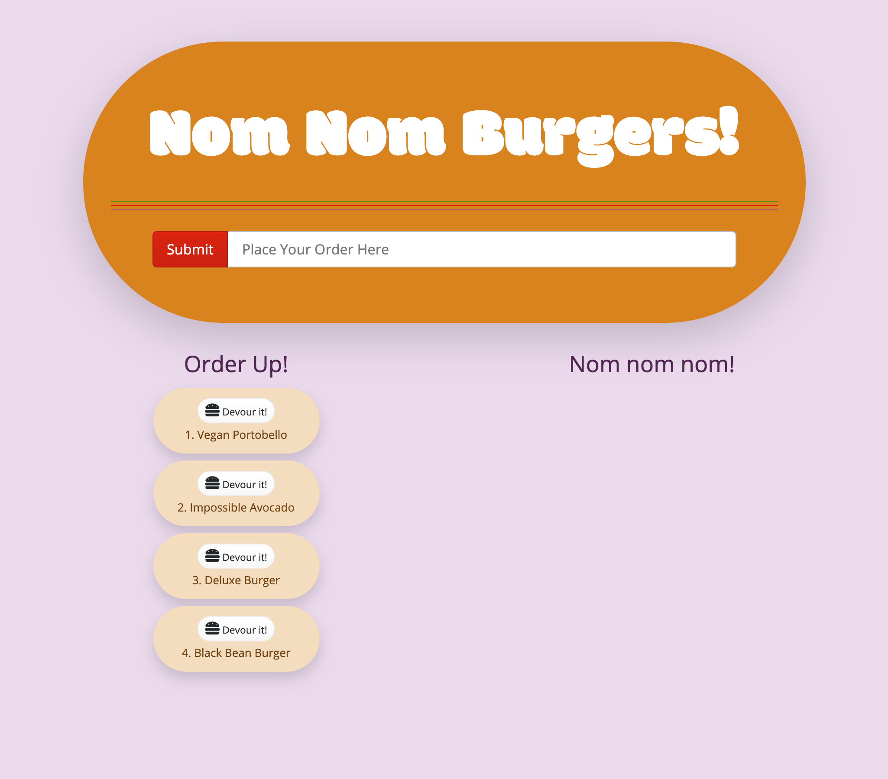

  * Once served, they can be transfered to the "Nom nom nom" completed orders history log by clicking the "Devour it!" button.

    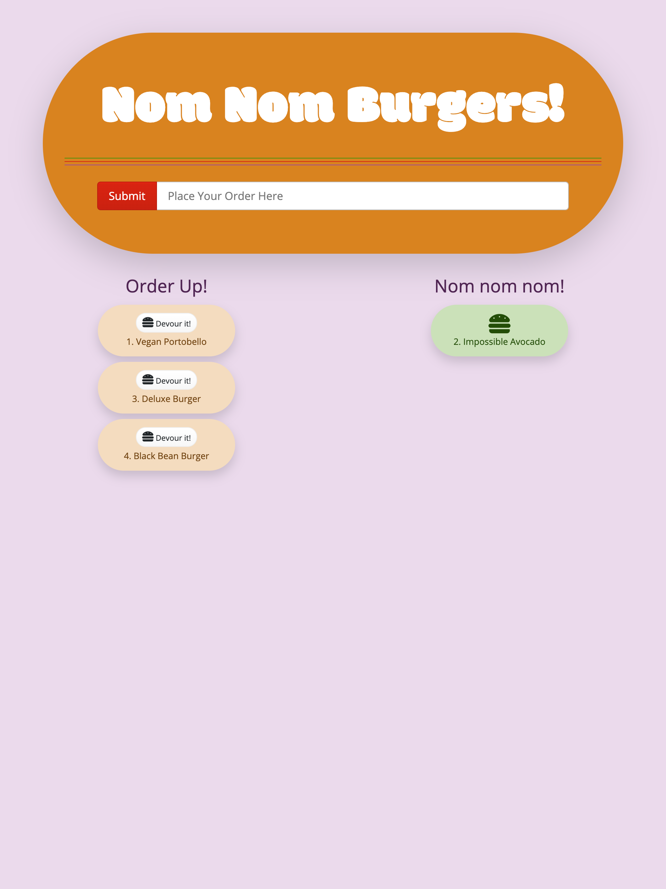   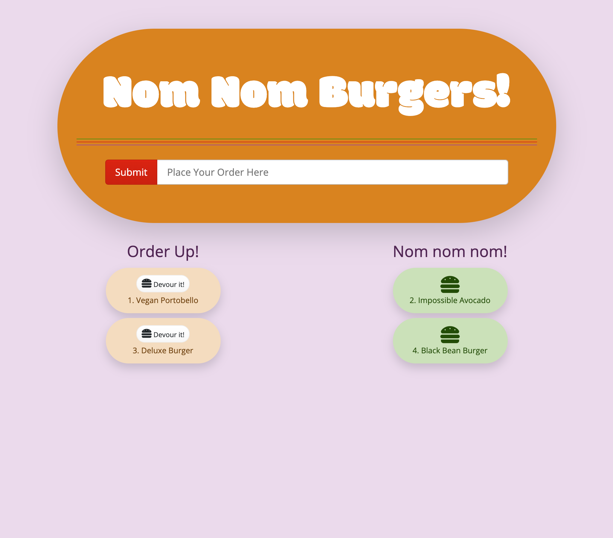

    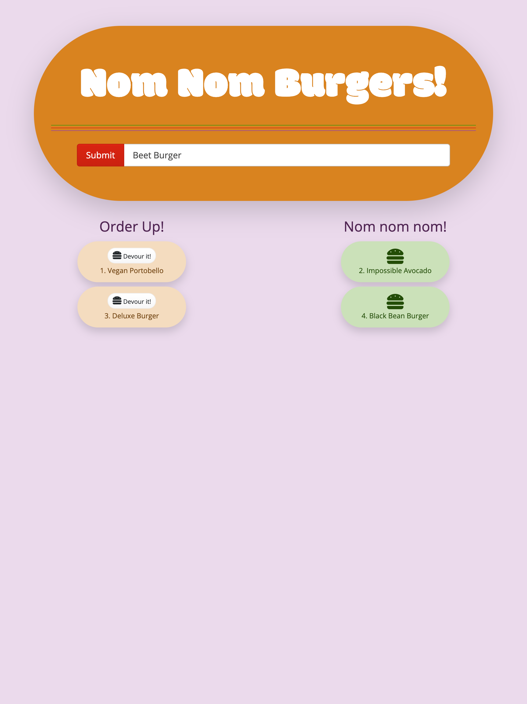   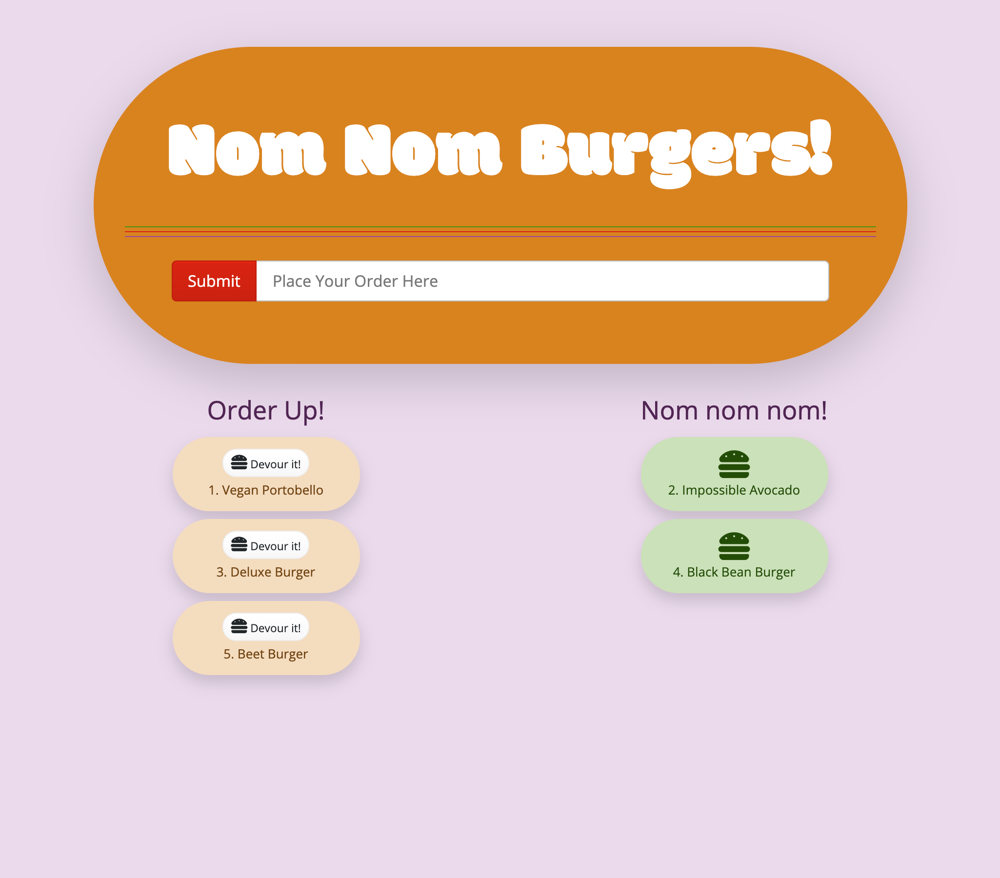

    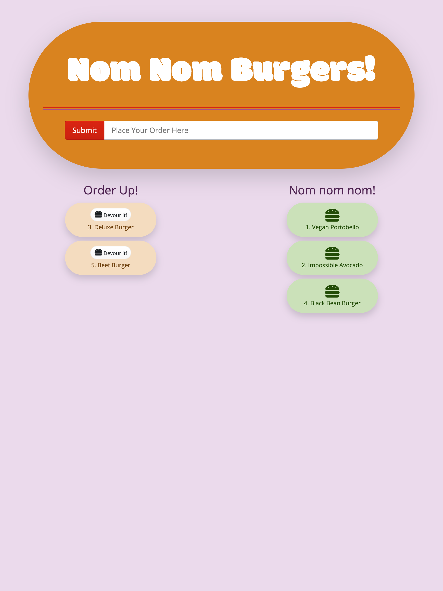   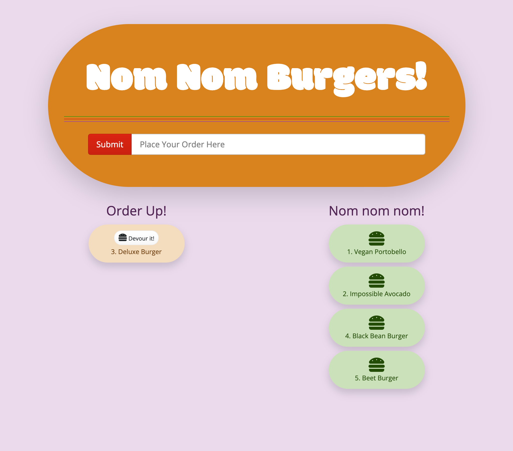

    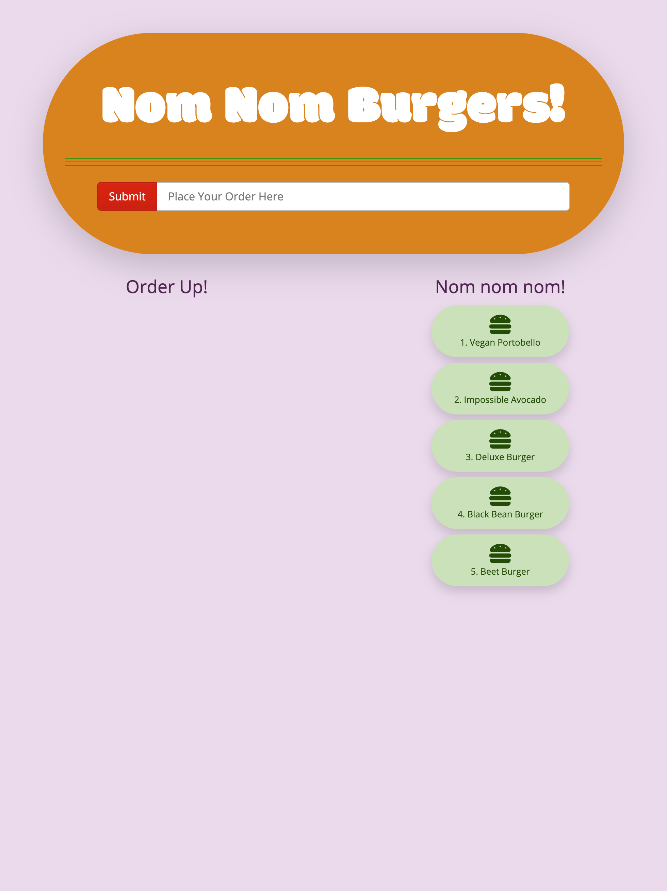   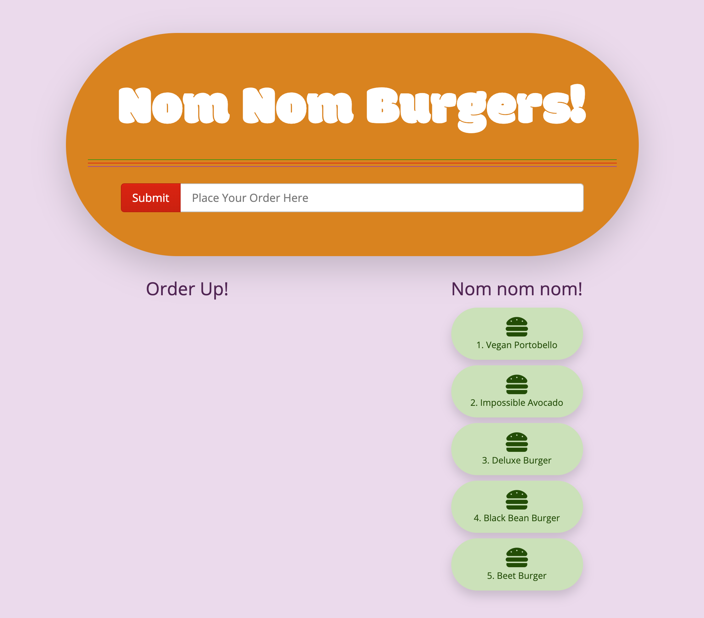

  ## FutureDevelopment
  Future features include an additional boolean column for whether the order is prepared or not so that the app can facilitate communication between the kitchen and front of house. From the UI this would divide the Order Up! section of orders placed into those that are being prepared and those that are ready to serve. Another feature would be the option to view completed orders by the current day and hour.

  ## License
  Licensed under the Unlicense license.

  ## Contributing
  Please follow the Contributors Covenant when contributing to this project.

  ## Tests
  Test will be a future feature.

  ## Questions
  Please contact me with any questions through my GitHub profile [SEGH](https://github.com/SEGH) or [email](mailto:segh@fastmail.com)
